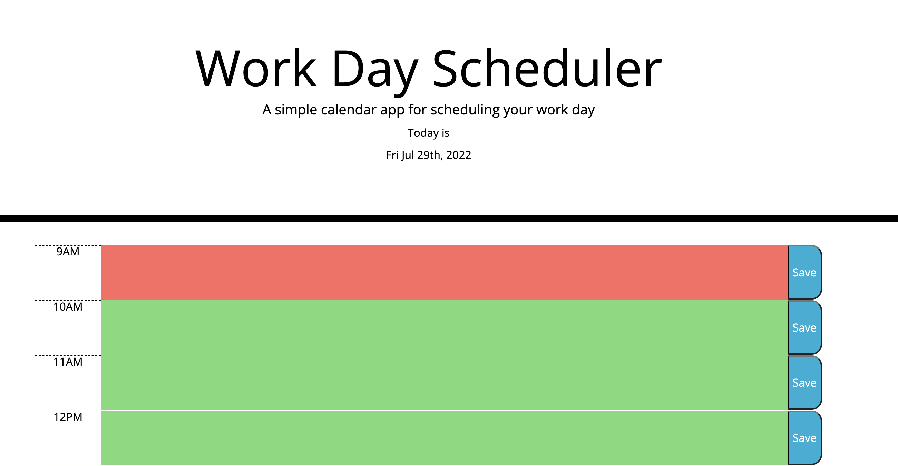

# Scheduler-Template-CNR

## Description

My goal was to create a scheduler application that users could easily update with their own time frame  and activities.
This site allows users to enter text within a given time frame to schedule events in the past, present, and future.

## Usage

Users can enter information into each time block and save that information. If the user closes out and revisits the page their notes will be continue to be visible. Each time block is color coded depending on the current time for easy legibility.

## Credits

JavaScript Help A - https://www.w3schools.com/js/default.asp

JavaScript Help B - https://developer.mozilla.org/en-US/docs/Web/JavaScript

## Screenshot

 
## License

MIT License

Copyright (c) [2022] [Connor Banks Tamminen]

Permission is hereby granted, free of charge, to any person obtaining a copy
of this software and associated documentation files (the "Software"), to deal
in the Software without restriction, including without limitation the rights
to use, copy, modify, merge, publish, distribute, sublicense, and/or sell
copies of the Software, and to permit persons to whom the Software is
furnished to do so, subject to the following conditions:

The above copyright notice and this permission notice shall be included in all
copies or substantial portions of the Software.

THE SOFTWARE IS PROVIDED "AS IS", WITHOUT WARRANTY OF ANY KIND, EXPRESS OR
IMPLIED, INCLUDING BUT NOT LIMITED TO THE WARRANTIES OF MERCHANTABILITY,
FITNESS FOR A PARTICULAR PURPOSE AND NONINFRINGEMENT. IN NO EVENT SHALL THE
AUTHORS OR COPYRIGHT HOLDERS BE LIABLE FOR ANY CLAIM, DAMAGES OR OTHER
LIABILITY, WHETHER IN AN ACTION OF CONTRACT, TORT OR OTHERWISE, ARISING FROM,
OUT OF OR IN CONNECTION WITH THE SOFTWARE OR THE USE OR OTHER DEALINGS IN THE
SOFTWARE.
